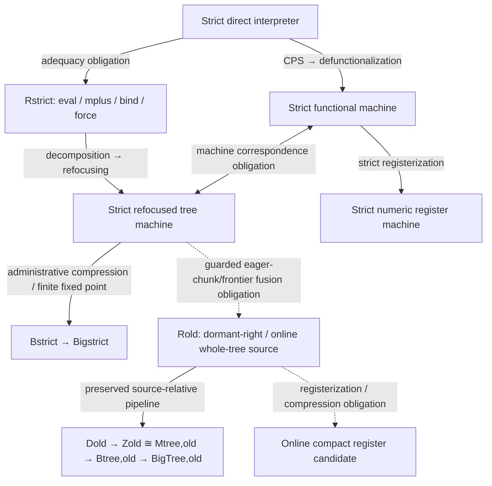

# Semantic policies and derivation matrix

The strict interpreter is the common source contract for the main functional
and syntactic derivations. The existing whole-tree source is preserved under
the name **dormant-right / online** as a historical comparison and candidate
guarded optimization. Extending the strict pipeline does not depend on that
optimization's fusion theorem.

## Coordinates

Write a coordinate as `T[p, i, rho; scheduler]`, with only the combinations
actually constructed admitted:

| Coordinate | Meaning |
| --- | --- |
| `p` | Branch evaluation: `strict-round` or `dormant-right` (online) |
| `i` | Feature node: core, Delay, Disjunction, Search, and any explicitly constructed overlays |
| `rho` | Representation, including the separately selected S/E/N strategies |
| `T` | Derivation stage: R, D, Z, Mtree, Btree, BigTree; further stages need their own construction |
| `scheduler` | A fiber where defined, such as DFS, flip, or rail; independent of operand strictness |

For `strict-round`, a round is finite eager evaluation to the next mature
Search boundary, conditional on guardedness. It does not mean that arbitrary
goal evaluation is total. `Yield(σ,S)` contains a Search value, while
`Delay(c)` retains a computation that can advance only when forced. In
particular, `mplus(eval(g1,σ),eval(g2,σ))` evaluates its operands left-to-right
before merging. `bind` evaluates the continuation result and the recursive
residual of an eager `Yield` before applying `mplus`.

For `dormant-right`, expansion creates `DisjL(Work(g1,σ),Work(g2,σ))` and the
active work context visits the left child. The machine may commit a left
answer before evaluating the right goal's finite eager work. This distinction
first arises at Disjunction and is inherited by Search and any higher
coordinates. Core, allocation machinery, and Delay-only machinery remain
reuse candidates; reuse still requires checking their stated domains and
allocation policies.

The old phrase "policy-neutral Search join" means neutral among later
scheduler fibers. That join already inherits dormant-right evaluation from
Disjunction. It does not range over both values of `p`.

The implemented strict full coordinate is Search/rail: its `mplus-delay` rule
is an explicit interaction in addition to the child feature rule sets. Its
Core, Delay, and Disjunction embeddings are checked, but it does not inherit
the online family's literal-union law. Strict DFS/flip and relcalls have not
been constructed.

## Artifact inventory

The following locations were inspected at the recorded revisions. Sibling
branch artifacts are preserved in Git; they are not present as directories in
this active checkout. Their old status reports are not rerun results.

| Artifact | Policy and location | Scope |
| --- | --- | --- |
| Preferred retained-scope S account | `strict-round`; [source and interpreter](../racket-server/derivations/strict-search/retained-scope/README.md) | Introductions retained on active computation; functional/syntactic configuration correspondence, registers and first compression with prescribed spans |
| Earlier numeric direct interpreter | `strict-round`; [`direct-interpreter.rkt`](../racket-server/derivations/functional-search/direct-interpreter.rkt) | Control-contract witness for eager `Yield`, strict `mplus`/`bind`, explicit Delay and nested rail |
| Strict numeric column | `strict-round`; [`strict-search/PIPELINE.md`](../racket-server/derivations/strict-search/PIPELINE.md) | Implemented R/D/Z/Mtree/B/Big, functional derivation, and numeric register machine; exact finite trace/certificate checks |
| Strict S/E/N matrix | `strict-round`; [`strict-search/matrix/`](../racket-server/derivations/strict-search/matrix/README.md) | Twelve native cells: Core, Delay, Disjunction, Search/rail in S/E/N through R/D/Z/Mtree/B/Big, with direct stage maps, feature embeddings, and finite correspondence checks |
| Earlier strict S functional derivation | `strict-round`; [`strict-search/s-functional/`](../racket-server/derivations/strict-search/s-functional/README.md) | Explicit-prefix checkpoint: direct → ANF → CPS → data/dispatch → transitions → registers; commitment, incremental boundaries, and finite intermediate S/E/N machine comparisons |
| Active production lattice | `dormant-right`; [`src/search-lattice/`](../racket-server/src/search-lattice/), base `41b28513dd61a8c25fab260ef85927463f49a455` | Production feature family and scheduler fibers; operational rules preserved |
| Preserved online S/E/N matrix | `dormant-right` from Disjunction upward; branch `codex/search-lattice-representation-composition` at `a937fb96960959153e31db72c2875294c248f0d4`, `racket-server/derivations/search-lattice/` | Core, Delay, Disjunction, Search through R/D/Z/M/B/Big; bounded correspondence evidence, no rail or relcall coordinates |
| Marked whole-tree pipeline | `dormant-right`; branch `codex/whole-tree-redex-column` at `229bb0cd277d53533f76a5872cd35e88938fa932`, `racket-server/derivations/refocusing/whole-tree-redex-column/` and `whole-tree/reference/marked/` | Marked late/factored rail cell without relcalls; source-relative exact arrow contracts and their recorded validation |
| Online compact register candidate | Candidate representation downstream of the online policy | Separate from the implemented strict numeric register machine; no inherited strictness/fusion theorem or implemented N/late/rail/relcall coordinate |

The selected S/E/N matrix's normative representation decisions remain in its
`ARCHITECTURE-CONTRACT.md`; its README distinguishes generated artifacts,
independent source oracles, finite-corpus checks, and universal theorem claims.
The strict matrix preserves those representation decisions and row kernels,
with extraction provenance and the reachable domain stated in its own notes.
It instantiates strict control equations and direct maps throughout; the
dormant-right Disjunction-and-higher instances retain their original policy.

## Pipeline placement

The diagram states relationships and obligations, not a claim that every
arrow has been universally proved. The existing column remains
`Rold → Dold → Zold ≅ Mtree,old → Btree,old → BigTree,old`, with the exact
scope of each original arrow and checkpoint retained. No old proof is lost
by changing the interpretation of `Rold`.

In the functional derivation, strict disjunction yields frames retaining the
right goal while evaluating the left, and then retaining the mature left
Search while evaluating the right (`AfterDisjLeft`, `AfterDisjRight`). A
`Job` produced by defunctionalizing a Delay closure denotes an actual Delay
resumption. Postponing an arbitrary right operand in a scheduler `Job` is an
additional semantic transformation. An administrative trampoline bounce is
not an object-language Delay.

Program syntax, active search, and settled output are distinct roles within
each strict representation, not additional S/E/N choices. The S functional
route represents them explicitly: goals are syntax; Empty/One/Yield/Delay
are active search; commit constructs Done/Last/Emit and leaves pending search
under unary More(Delay). A real commitment frame separates the runtime
domains. The matrix now has its own explicit commit context and native
partial Frontier normal forms. Refocusing retains that context as a commit
frame; advance/collect are source operations rather than external stopping
rules. The older render remains an explicit full-consumption observer. This
partial commitment stops at Delay and introduces no online fusion or new
scheduling policy. The [direct machine comparison](../racket-server/derivations/strict-search/COMMITMENT.md)
also retains strict `prefix(O,E)`, deriving the analogue of KPrefix instead
of moving ownership onto a running computation. Public and bind resumptions
expose their raw bodies without synthetic force/redelay steps. E/N retain
the erased prefix phase so vertical step squares remain exact. The remaining
many-to-one representation choices are audited explicitly, and finite checks
prescribe zero or one source contraction per functional transition.

S/E/N kernels and machine configurations use data. Functional continuations
and resumptions belong in the functional derivation's source/CPS stages and
become data through defunctionalization. Sharing primitive equations does
not require a shared higher-order outcome protocol across these boundaries.

## Claims and observations

| Relationship | Required claim and boundary |
| --- | --- |
| Strict interpreter ↔ Rstrict | Adequacy, including strict operand and eager-tail evaluation; executable examples alone are bounded evidence |
| Rstrict ↔ strict refocused machine | Syntactic correspondence, with decomposition and refocusing justified |
| Strict interpreter ↔ functional machine | CPS and defunctionalization correspondence; explicit eager merge frames |
| Two strict machines | Correspondence on a stated configuration relation, beyond coincident final readbacks |
| Strict machine ↔ online source/machine | New guarded eager-chunk/frontier fusion theorem for an explicitly chosen observation and pure deterministic kernel |
| Functional machine ↔ strict numeric registers | Direct structural decoder and one-for-one dispatch correspondence; composition with tree stages uses their separate source correspondence |
| Online tree ↔ compact register candidate | Separate representation obligation, with divergence-sensitive administrative progress |
| Finite machine runs ↔ Big fixed point | Finite-run theorem, without totalizing divergence |
| Productive infinite behavior | Separate stream/coinductive theorem with progress and fairness hypotheses stated |

Full work traces differ: a strict trace may execute `p; q; emit`, while an
online trace executes `emit; p; q`. Neither refocusing nor registerization
alone justifies that change. Exact completed `Emit`/`Forced`/`Last`/`Done`
readbacks, answer/delay streams, and eventual-answer sets are distinct
observations. A theorem for eventual-answer sets intentionally forgets order,
latency, and delay rounds and cannot establish the stronger observations.

Guarded finite witnesses currently motivate the proposed bridge; they do not
prove it generally. Without guardedness, `success(A) ∨ Ω` prevents strict
evaluation from returning even its first Search value, while online evaluation
can commit `A` before diverging. A pure kernel alone does not remove this
counterexample.

The next bridge checkpoint must include finite eager progress to a
Delay/terminal boundary, nested rail orientation, eager conjunction/bind
residuals, and exact completed readbacks. Relcalls require a separately stated
guardedness domain and relation-entry suspension policy before extension.
