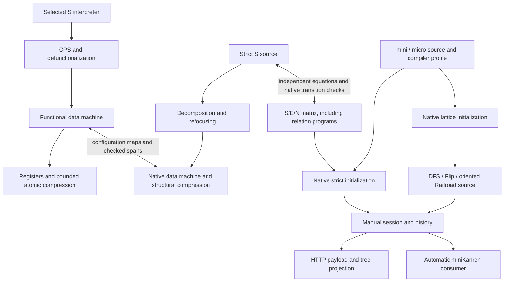

# Semantics and application organization

The selected account is [retained-scope S, Search/rail](../racket-server/derivations/strict-search/retained-scope/README.md).
Its functional and syntactic derivations meet through explicit configuration
maps and prescribed transition spans. The [native S/E/N matrix](../racket-server/derivations/strict-search/matrix/README.md)
uses the same factoring, including a full relation-program extension. The
Strict Search view executes that matrix's S reduction relation directly.
The GUI defaults to the separate native Lattice search family, with Railroad,
No Interleave, and Flip-Flop schedulers. Their shared application infrastructure
does not assert that the two operational sources are equivalent.

The [research inventory](../racket-server/derivations/strict-search/README.md)
owns the detailed artifacts and proof obligations. The
[correction log](../racket-server/derivations/strict-search/CORRECTIONS.md)
records the earlier strictness, scope, and commitment mistakes.

## Independent choices

| Choice | Coordinates | What it changes |
| --- | --- | --- |
| Compilation profile | Conjunction left/right × disjunction left/right × delay placement relbody/relcall/disj | Twelve ways to associate the source goals and insert explicit suspensions |
| Runtime | Lattice search / Strict Search | Select the native online work-tree or strict Search source |
| Lattice scheduler | No Interleave / Flip-Flop / Railroad | Preserve left activity, swap branches, or retain explicit left/right orientation |
| Allocation representation | S / E / N | Introductions on syntax / ordered state support / numeric state supply |
| Call-free feature | Core / Delay / Disjunction / Search/rail | Four goal and computation languages, giving twelve S/E/N feature cells |
| Full relation language | Search/rail plus relations in S / E / N | Three additional cells with definitions and recursive calls |
| Derivation stage | R / D / Z / M / B / Big; functional machine and registers | How the same operations and pending work are represented |

The twelve compiler profiles are not the twelve representation/feature cells.
The strict GUI view uses the full S source stage R. Lattice search uses its
native owner-annotated source. E/N are native research representations
connected by structural maps, not GUI allocation selectors.
Strict Search/rail has an explicit `mplus-delay` interaction; it is not merely
the literal union of the Delay and Disjunction rule sets.
The historical strict “Search/rail” name does not denote the oriented
Railroad scheduler. Lattice DFS/Flip grammars contain `DisjL`; Railroad adds
`DisjR` and the corresponding right-active work path.

## The computation being represented

Both runtimes share compiled goals, relation definitions, source IDs, and
query metadata. Initialization selects a native wrapper:

```text
Strict:  (program Γ (commit (eval (Owners) query-goal initial-state)))
Lattice: (Γ (More (Work (Owners) query-goal initial-state)))
Γ = ((r:name (x:parameter ...) body) ...)
query-info = surface names, runtime variable identities, source tag, requested limit
```

Within strict `(program Γ q)`, q is the current computation or observation.
For the retained-scope S account:

```text
Search   ::= Empty(O) | One(O,σ) | Yield(O,A,Search) | Delay(O,c)
A        ::= Answer(O,σ)
Frontier ::= Done(O) | Last(O,A) | Emit(O,A,Frontier)
           | Forced(O,Frontier) | More(Delay(O,c))
```

`eval`, `mplus`, `bind`, and `force` make the pending work explicit. Both
`mplus` operands mature left-to-right before merging; `Yield` tails and bind's
head and residual work are eager. Only `Delay` suspends computation. Search
candidates can still have pending bind obligations. `commit` matures its
operand and builds settled Frontier output; it does not force a Delay.

A Frontier ending in `More(Delay(...))` is a paused normal form. `advance`
preserves its committed prefix and crosses one exposed Delay. `Done` and
`Last` are completed normal forms. Internal `force` and public `advance` are
separate operations, and host dispatch/trampolining does not create an
object-language Delay.

S retains ordered tagged Owner groups around active computations. Common
groups scope both branches or the answer and residual; answer-private groups
stay with that answer. Allocation uses the active path's introductions,
including unused and sparse ancestry. E/N carry the corresponding world in
their native states. Internal S force retains the removed Delay's Owners on
its active body; E/N enter the body with their state-local supply.

Strict calls expand through `eval-call`; lattice calls use their own native
relation rule. Neither call expansion inserts a Delay. The program or compiler
profile determines suspension. In the strict derivation, Γ remains
explicit in source programs, syntactic program frames, and functional
`ProgramGoal`/`KProgram` data; recursive Big premises carry that environment too.

Source IDs identify occurrences before compiler lowering. Reassociation and
inserted delays preserve those origins: binary disjunctions generated from
one `conde` refer to its source span, while two identical calls at different
source locations retain different IDs. Runtime copies of one relation body
reuse that body's source IDs. The compiler consumes its occurrence map;
machine configurations carry the resulting labels directly.

## Derivation and application connections



| Module | Responsibility |
| --- | --- |
| [transpiler/](../racket-server/src/transpiler/) | Parse mini/micro, associate goals, insert profile-selected delays, retain source IDs, initialize the selected native syntax and query metadata |
| [search-lattice/](../racket-server/src/search-lattice/SEMILATTICE.md) | Native DFS, Flip, and oriented Railroad source relations and WF |
| [matrix/full-source.rkt](../racket-server/derivations/strict-search/matrix/full-source.rkt) | Actual full S/E/N reduction relations and explicit call expansion |
| [search-runtime.rkt](../racket-server/src/search-runtime.rkt) | Select native strict or lattice relations and WF; expose structural status and public boundaries |
| [program-runner.rkt](../racket-server/src/program-runner.rkt) | Manual sessions, one-step execution, exact configuration history, back/reset, query metadata |
| [app.rkt](../racket-server/src/app.rkt) | HTTP initialization, stepping, history and source-conversion endpoints |
| [search-picture.rkt](../racket-server/src/search-picture.rkt) | Project either actual carrier and state into the tree; extract answers only along the committed Frontier |
| [minikanren.rkt](../racket-server/src/minikanren.rkt) | Automatic answer consumption, run/run*, host-facing library and evaluator entry points |

The GUI preserves `running`, `paused`, `complete`, and `stuck` distinctions.
Stepping a paused strict Frontier records an explicit public `advance`
invocation before its source contractions. A paused lattice Frontier instead
uses the native `force-delay` reduction, marked as a public operation. Both
histories store their own source terms. Manual GUI/session stepping ignores `run n`'s
requested answer limit. Automatic consumption belongs to `minikanren.rkt`:
it stops at an exposed Delay or terminal Frontier and returns the requested prefix while
retaining the whole saved Frontier. In the strict model this finishes the
current eager round and commitment. A zero limit can return without stepping.

The GUI defaults to Lattice search and explicitly requests `rail`. Its
separate Strict Search selection sends `{ "model": "strict" }` and hides the
scheduler controls while remembering the lattice choice. API and library
calls that omit a selection default to `(strict-search)`; an explicit
`(search-strategy "rail")` selects native lattice Railroad. The runtime and
compilation settings remain independent. See the
[policy boundary](semantic-policy-matrix.md).

## Evidence and remaining work

The final live GUI check on 2026-09-07 ran this microKanren source through
all four selections:

```racket
(run* (q)
  (disj (Zzz (== q 'a))
        (disj (== q 'b) (Zzz (== q 'c)))))
```

Every run completed and replayed its exact payload after Back/Step:

| Runtime | Steps | Answers | Observed control |
| --- | --- | --- | --- |
| Lattice Railroad | 16 | `b, a, c` | Reached `DisjR`; paused at 4/11, public `force-delay` at 5/12 |
| Lattice Flip-Flop | 16 | `b, a, c` | No `DisjR` |
| Lattice No Interleave | 14 | `a, b, c` | No `DisjR` |
| Strict Search | 26 | `b, a, c` | Explicit public `advance` and internal force |

The mini `same` example with conjunction right-associated, disjunction
left-associated, and Delay at every relation call completed in Flip-Flop in
28 steps with `dog, fish, turtle, cat`. The source selection highlighted exactly
`(same q 'fish)` and preserved the compiler settings. A delayed initialization
response confirmed that runtime controls freeze before the request completes.
These are application witnesses, not cross-runtime equivalence claims.

Checks compare native configurations, named edges, prescribed administrative
spans, intermediate Frontiers, actual work order, and exact allocation scope.
The full S functional route includes explicit relation environments through
its generated machine, registers, and existing compression. E/N functional
interpreters and register programs have not been separately derived.

The matrix has independent finite Big equations and certificate maps. Finite
checks do not establish universal adequacy, preservation, machine
correspondence, or productive-stream theorems. Further compression to a
`κ / Q / π` machine remains an investigation, not the implemented target.
The [test lanes](../racket-server/tests/TEST-LANES.md) identify executable gates
and the latest completed validation. The headless gate runs strict research
and current application suites, including native lattice source tests and
scheduler integration. Native scheduler integration accepts partial interpreter
correspondence and supplies no strict-to-online fusion theorem.
