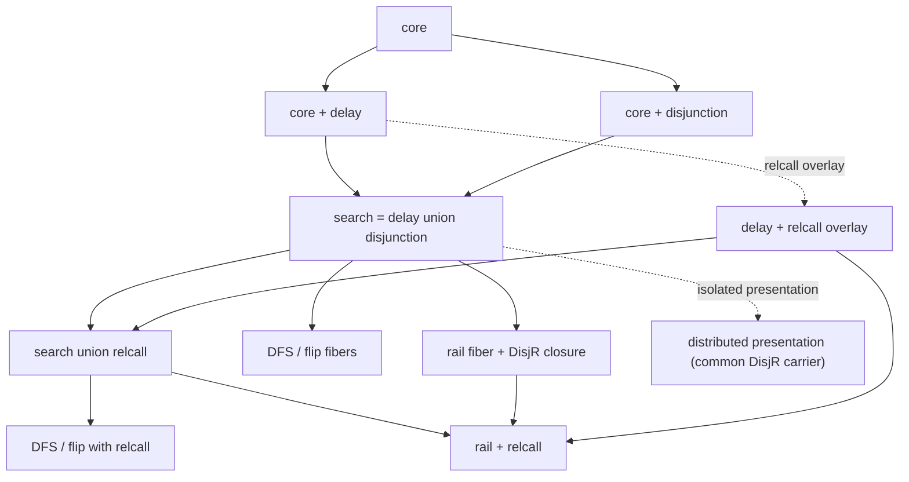

# Semantics organization

The preferred current account is the
[retained-scope source and interpreter](../racket-server/derivations/strict-search/retained-scope/README.md).
`Yield` has an eager Search tail; only `Delay` suspends computation. Introductions
remain on the active computation, and commitment separates Search from settled
Frontier. The [strict-search guide](../racket-server/derivations/strict-search/README.md)
is the authoritative inventory of its derivations and the aligned retained-scope
S/E/N source, stage, and finite Big matrix. It also records the remaining adequacy and
machine-correspondence obligations.

The active app runtime remains the decorated search lattice under
`racket-server/src/search-lattice/`. Its disjunction-and-higher coordinates use
the **dormant-right / online** branch-evaluation policy. They are retained as
an online implementation and comparison family. Correspondence with the strict
interpreter requires a separate guarded fusion theorem; exact derivation from
this online source does not establish that theorem.

Within the online family, delay and disjunction extend core additively; search
is their literal union; one factored source supplies control; and scheduler
fibers select answer order, with the right-active carrier local to rail.
The [policy boundary](semantic-policy-matrix.md) distinguishes this live
runtime from the selected research account.

## Additive features and scheduler fibers

This diagram describes the existing online family. Its additive Search join is
neutral between scheduler fibers, but already inherits dormant-right operand
evaluation from disjunction. Scheduler neutrality is not strict-round
evaluation.



Delay and disjunction are additive feature extensions of core. Search is their
literal language and reduction-relation union; it adds no constructor or rule.
Relcall extends delay independently, and search-relcall is the corresponding
union with search. DFS and flip are scheduler fibers over those literal unions.
Rail is also a scheduler fiber, but its execution representation extends search
with `DisjR`; six right-active closure rules and the two rail scheduling
transitions are consequently rail-owned. Rail is not a new feature node.

The module dependencies mirror those semantic arrows. Production `search-red`
combines assembled disjunction with the delay deltas so core is inherited once;
`rail-red` lifts assembled search and adds only its local rail delta; and
`rail-relcall-red` lifts assembled search-relcall plus that delta under `Γ`.
None of these modules rebuilds the lattice from lower feature relations.

The distributed presentation is retained under
`racket-server/src/search-lattice/experiments/distributed/`. It extends the
production carrier with experiment-only focus indices and has its own relations
and tests. It is not imported by the production aggregators or exposed as a
runtime strategy. Its retained raw join seam exists only to regroup rules under
the experimental `Early*` focus grammar; production search does not consume
that seam.

The experiment deliberately preserves its pre-split common right-active
carrier: distributed search, DFS, and flip may contain `DisjR` and the
right-active normalization/closure rules; distributed rail adds only its two
scheduling transitions. This bounded exception is not a claim that production
search or production DFS/flip admit the rail carrier.

## Carrier and compositional focus grammar

`W` is unfinished work and `F` is the whole answer frontier:

```text
owner  ::= Owner(intro, tag)
owners ::= Owners(owner ...)

A ::= Answer(owners, σ)
S ::= Returned(owners, σ)

W ::= Work(owners, g, σ)
    | Returned(owners, σ)
    | Dead(owners)
    | Conj(owners, W, g)

F ::= More(W) | Done(owners) | Last(owners, A)
```

The explicit `Owners(...)` stack is ordered outermost-to-innermost. One record
retains one binder's ordered, duplicate-free introduction list and label; the
stack is structural provenance, not cumulative allocated-name support. Delay
adds `PendingDelay(owners,W)` and `Forced(owners,F)`;
disjunction adds `DisjL(owners,W,W)` and `Emit(owners,A,F)`. Search adds
nothing. The rail fiber adds `DisjR(owners,W,W)`. The delayed-rooted relcall
overlay adds relation goals, `Γ`, and configurations `(Γ F)`.

Focus is assembled from recursive context categories:

- `WorkOwnerSlot` selects the owner field of any assembled work constructor;
- `WorkPath` recurses through the active child of `Conj` and is extended
  directly by disjunction through `DisjL` and by rail through `DisjR`;
- `SpineContext` is extended directly by delay through `Forced` and by
  disjunction through `Emit`;
- `WorkFocus` is `SpineContext · More · WorkPath`.

Each additive feature extends only `WorkOwnerSlot`, `WorkPath`, or
`SpineContext` for constructors it owns; rail does the same for its right-active
carrier. The fixed `Owners` wrapper lets each owner slot or recursive context
form use one production for empty and nonempty stacks. `PendingDelay` is a
suspension barrier and therefore does not extend `WorkPath`. No runtime W/F
tag, dynamic compatibility predicate, or host-language focus dispatcher is
present.

## Factored source and scheduler fibers

The source for this online family is the factored source. It continues down the
active work path. Expanding disjunction creates two `Work` children while
`WorkPath` visits only the active child; the right goal can remain unevaluated
when a left answer is committed. Strict Racket evaluates both `mplus` operands
before the merge starts. Strict `bind` also evaluates its continuation result
and recursive eager tail before merging. Changing only `WorkPath` or the
answer-commit rule therefore does not supply the strict Search semantics.

Ordinary search resumes a settled left-active choice through
`resume-left-choice-success`; rail's right-active closure includes
`resume-right-choice-success`. Literal named Redex rules are closed under the
compositional focus grammar; host Racket performs kernel operations but does
not choose the control rule.

The surfaced strategy object is:

```text
{ scheduler: "dfs" | "flip" | "rail" }
```

Rail is the default. DFS and flip use the literal search grammar and WF
judgments, which exclude `DisjR`. Rail uses `rail-lang` and `rail-wf`, which add
that right-active carrier. The relcall variants make the same distinction.

## Compiler and runtime boundary

The canonicalizing compiler `parse-prog/canonical` emits production `(Γ F)`
syntax directly. Initial work is rooted as `More(Work(...))`.

The app and program runner:

1. parse/canonicalize mini or micro source directly into `(Γ F)`;
2. select DFS, flip, or rail;
3. check the matching search-relcall or rail-relcall language and WF judgment;
4. step the named Redex relation;
5. render through `racket-server/src/search-lattice/picture.rkt`.

The exported runner structures consequently contain W/F runtime terms. Source
text and answer-returning entry points remain the stable public boundary.

## WF and structural observations

Each feature WF module instantiates a shared schema of direct proposition
judgments. A metatheoretic inherited list records introductions visible along
the current path. Each owner record is checked in stack order and extends that
list before its node payload is checked. States remain four-field values; no
summary term, cached scope, counter, or complete runtime support is present.

`racket-server/src/search-lattice/structural-observations.rkt` independently
counts owner-record occurrences, introduced-name occurrences, committed
`Answer` nodes, and `Forced` nodes. These are syntax measurements, not
allocation-event counts and not inputs to WF.

Allocation remains a whole-frontier Redex rule. The rule names the complete
live frontier `F_support`; logical-variable occurrences throughout that term
derive the allocated-name support passed implicitly to `variables-not-in`.
The traversal sees every live state, answer, sibling, dead path, terminal path,
and owner stack. A
multi-variable binder receives names sequentially in lexical order and adds
one new innermost `Owner` record. The same frontier therefore has one
deterministic raw allocation proof.

## Semantic boundary

The production claims in this tree concern the online factored source, its
feature composition, scheduler fibers, and the finite operational traces
exercised by its tests. Its earlier source-relative correspondence results
remain applicable to that policy; they do not establish strict-interpreter
adequacy. The [research inventory](../racket-server/derivations/strict-search/README.md)
records maintained artifacts and deferred results separately.

The strict derivation must preserve left-to-right operand evaluation, eager
`Yield` construction, and the absence of reduction below an unforced `Delay`.
The proposed strict-to-online bridge may reorder finite pure work relative to
answer commitment. It therefore requires an explicit guardedness hypothesis,
a pure deterministic kernel, and a stated observation. Full work traces are
unequal. Guarded completed-frontier witnesses are evidence for a future bridge,
not its proof; productive infinite streams require a separate theorem.

Without guardedness, `success(A) ∨ Ω` distinguishes even answer prefixes:
strict evaluation never returns its first Search value, whereas the online
source can commit `A` before entering the diverging sibling. Registerization
and host trampolining must not silently introduce this semantic change.

## Reading order

- [Semantic-policy matrix](semantic-policy-matrix.md): interpreter authority,
  strict-round versus dormant-right, preserved branch artifacts, and theorem
  boundaries;
- [`strict-search/`](../racket-server/derivations/strict-search/): the separate
  strict Search source and its correspondence checkpoint;
- `racket-server/src/search-lattice/SEMILATTICE.md`: carrier, recursive focus
  grammar, feature ownership, and rule composition;
- `racket-server/src/search-lattice/wf/LAYERING-NOTES.md`: direct WF schemas and
  public judgments;
- `racket-server/src/search-lattice/PICTURE-DESIGN-NOTES.md`: operational and
  extensional observations;
- `racket-server/tests/search-lattice/README.md`: mirrored node, edge, join,
  grammar, fiber, overlay, law, and experiment responsibilities;
- `racket-server/tests/TEST-LANES.md`: executable gate inventory.

Source edge suites establish embedding, conservativity, and provenance. They
are not naturality tests: no second derivation transformation or commuting
square is present at the source-only stage.

Pass counts belong in a checkpoint handoff tied to an exact HEAD; no potentially
stale count is asserted here.
