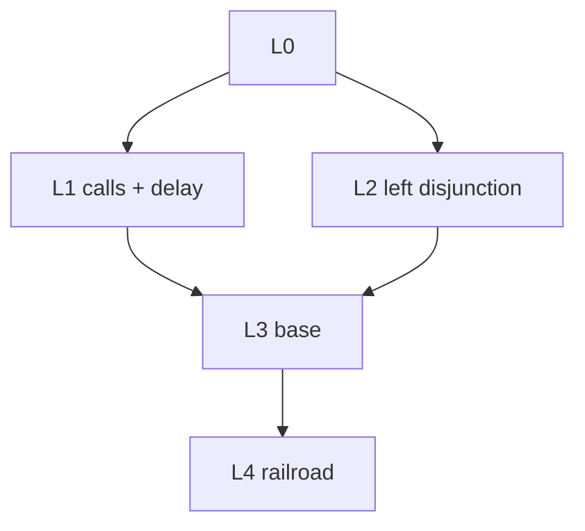

# Semantics Ladder

This repo now treats the backend semantics as a levelled family:

- `L0`: core goals, states, search trees, and answer streams
- `L1`: `L0` plus relation calls and operational delay forms
- `L2`: `L0` plus left disjunction
- `L3`: the join of `L1` and `L2`
- `L4`: `L3` plus railroad/right-disjunction syntax

## Family Tree

## Module Layout

### Languages

| Level | File | Adds |
| --- | --- | --- |
| `L0` | `racket-server/src/languages/l0.rkt` | Base terms, states, search trees, `L0/Kconj` |
| `L1` | `racket-server/src/languages/l1-calls-delay.rkt` | Relation calls, `suspend`, `delay`, `proceed` |
| `L2` | `racket-server/src/languages/l2-disjunction-left.rkt` | Goal disjunction, left-search-tree disjunction, `Kdisj` |
| `L3` | `racket-server/src/languages/l3-base.rkt` | Joined language, inheriting `Kconj` and `Kdisj` |
| `L4` | `racket-server/src/languages/l4-railroad.rkt` | Railroad `+->` syntax, extending `Kdisj` |

### Well-Formedness

| Level | File |
| --- | --- |
| `L0` | `racket-server/src/wf/l0.rkt` |
| `L1` | `racket-server/src/wf/l1.rkt` |
| `L2` | `racket-server/src/wf/l2.rkt` |
| `L3` | `racket-server/src/wf/l3.rkt` |
| `L4` | `racket-server/src/wf/l4.rkt` |
| Boundary helpers | `racket-server/src/wf/all.rkt` |

### Public Reduction Relations

| Relation family | File |
| --- | --- |
| `Rl0-core` | `racket-server/src/reduction-relations/l0.rkt` |
| `Rl1-call-eager` | `racket-server/src/reduction-relations/l1-call-eager.rkt` |
| `Rl1-call-lazy` | `racket-server/src/reduction-relations/l1-call-lazy.rkt` |
| `Rl2-disj-left` | `racket-server/src/reduction-relations/l2-disj-left.rkt` |
| `Rl3-base-eager` | `racket-server/src/reduction-relations/l3-base-eager.rkt` |
| `Rl3-base-lazy` | `racket-server/src/reduction-relations/l3-base-lazy.rkt` |
| `Rl3-dfs-eager` | `racket-server/src/reduction-relations/l3-dfs-eager.rkt` |
| `Rl3-dfs-lazy` | `racket-server/src/reduction-relations/l3-dfs-lazy.rkt` |
| `Rl3-flip-eager` | `racket-server/src/reduction-relations/l3-flip-eager.rkt` |
| `Rl3-flip-lazy` | `racket-server/src/reduction-relations/l3-flip-lazy.rkt` |
| `Rl4-rail-eager` | `racket-server/src/reduction-relations/l4-rail-eager.rkt` |
| `Rl4-rail-lazy` | `racket-server/src/reduction-relations/l4-rail-lazy.rkt` |

Shared rule fragments live under `racket-server/src/reduction-relations/private/`.

## Step-Name Vocabulary

Active step names are normalized by level/family:

- `l0/...`
- `l1/...`
- `l2/...`
- `l3-base/...`
- `l3-dfs/...`
- `l3-flip/...`
- `l4-rail/...`

This keeps traces aligned with the public reducer lattice instead of the old assembly pipeline.

## Surfaced vs Hidden Models

Only the intended `L3` and `L4` models are surfaced in the UI:

| Surfaced | Hidden/internal |
| --- | --- |
| `l3-dfs-lazy` | `l0-core` |
| `l3-flip-lazy` | `l1-call-lazy` |
| `l4-rail-lazy` | `l1-call-eager` |
| `l3-dfs-eager` | `l2-disj-left` |
| `l3-flip-eager` | `l3-base-lazy` |
| `l4-rail-eager` | `l3-base-eager` |

## Runtime Contract

- The frontend chooses a model by sending `model` in `POST /api/post/init`.
- The canonical parser target remains `"L4/config"`.
- `step-once` wrappers are deterministic:
  - `0` successors means done
  - `1` successor means step
  - more than `1` successor is a determinism bug
