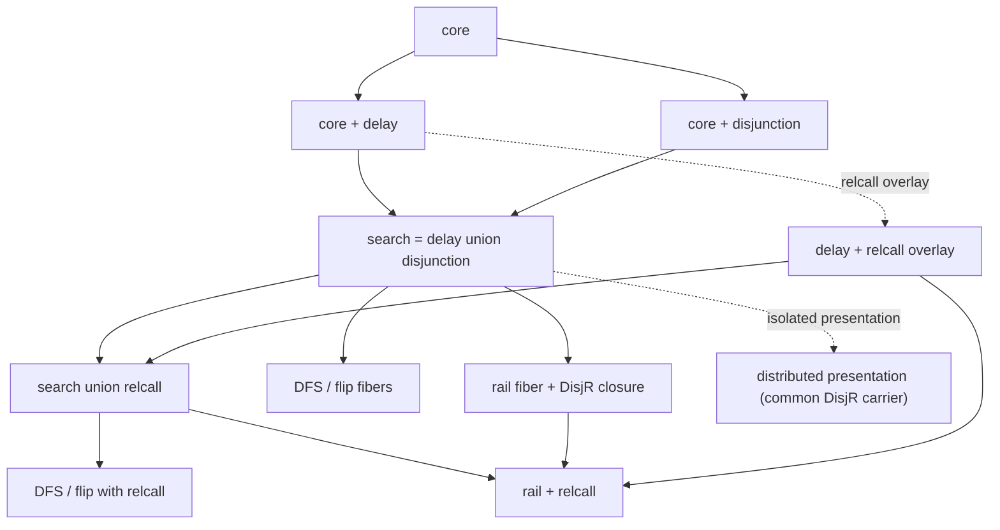

# Decorated search lattice

The decorated lattice is the production modular family. Its primary source is
one factored source assembled from core and two additive feature extensions.
Search is the literal union of delay and disjunction. DFS, flip, and rail are
scheduler fibers rather than additional feature nodes; rail alone extends the
carrier with its right-active execution state.

## Additive feature diamond



Delay and disjunction are additive feature extensions of core. Search is their
literal language and reduction-relation union, so it contributes no new
constructor or rule. Named-rule inventory tests verify exactly one inherited
copy of core behavior plus the delay and disjunction deltas.

Relcall is an overlay rooted in the delayed language. It adds relation goals,
`Γ`, configurations `(Γ F)`, and call expansion. `search-relcall` is the union
of that independently delayed-rooted overlay with search. `rail-relcall` is the
union of relcall and the rail fiber.

The production modules follow the same immediate-predecessor structure.
`search-red` combines assembled `disj-red` with the delay deltas, thereby
inheriting core exactly once. `rail-red` lifts that assembled `search-red` and
adds only `rail-delta-red` (the right-active closure and scheduler transitions).
`rail-relcall-red` likewise lifts assembled `search-relcall-red` and adds the
same rail delta under `Γ`; it does not reconstruct lower feature relations.

## Stratified carrier

`W` is unfinished work. `F` is the complete frontier and the root category.
Core contributes:

```text
A ::= Answer(owners, σ)

S ::= Returned(owners, σ)

W ::= Work(owners, g, σ)
    | Returned(owners, σ)
    | Dead(owners)
    | Conj(owners, W, g)

F ::= More(W)
    | Done(owners)
    | Last(owners, A)
```

The established goal language includes fresh, conjunction, equality,
disequality, success, and failure. An `owners` term has the explicit form
`Owners(owner ...)`; the records are ordered outermost-to-innermost. Each
`Owner(intro, tag)` stores one binder's ordered, duplicate-free introductions.
The stack is structural provenance, not cumulative allocated-name support, a
cache, a counter, or a second source of truth.

Each additive feature extension owns only its constructors:

| Additive feature extension | Additions |
| --- | --- |
| delay | `suspend`, `PendingDelay(owners,W)`, `Forced(owners,F)` |
| disjunction | `∨`, `DisjL(owners,W,W)`, `Emit(owners,A,F)` |

Search contributes no new constructor. The rail fiber owns
`DisjR(owners,W,W)` and its right-active frame. The delayed-rooted relcall
overlay owns relation goals, `Γ`, and `(Γ F)`. Committed answers remain in
`Emit`/`Last`; they are not treated as disposable history.

## Compositional focus grammar

The primary language derives focus from recursive context categories:

| Grammar | Role |
| --- | --- |
| `WorkOwnerSlot` | the leading owner field of one work constructor |
| `WorkPath` | zero or more active work-path constructors |
| `SpineContext` | zero or more frontier-spine wrappers |
| `WorkFocus` | a work path below `More`, under spine wrappers |

Core contributes owner slots for `Work`, `Returned`, `Dead`, and `Conj`, and
defines `WorkPath` recursively through `Conj`. Delay adds the `PendingDelay`
owner slot and extends `SpineContext` directly through `Forced`. Disjunction
adds the `DisjL` owner slot, extends `WorkPath` directly through the active
`DisjL` child, and extends `SpineContext` directly through `Emit`. Rail adds the
`DisjR` owner slot and extends `WorkPath` directly through the active right
child. The fixed `Owners` wrapper lets empty and nonempty stacks use one
production with one hole classification, so Redex gives each generated context
one raw derivation.

These grammars are indexed inductive structures: hole and result categories
are implicit in their productions. No explicit W/F state tag, scheduler tag,
or dynamic sort-compatibility check is used. If a rule overlap reappears when
host ordering is removed, the grammatical factorization is unfinished.

## Owner transfer

Every rule states where its input owner records go. Expanding conjunction keeps
the source owners on `Conj` and starts the active child with an empty stack.
When the child returns or fails, its owners append after the conjunction's
owners. The empty stack is `(Owners)`. Finishing a returned or dead work item
transfers that stack to `Last` or `Done`.

Choice introduction keeps the source owners on the choice root and gives each
new branch an empty stack. Pruning discards only the failed branch's owners and
attaches the choice owners to the survivor. Commitment partitions choice-root
owners, answer owners, and residual owners among `Emit`, `Answer`, and the
residual frontier. Reassociation attaches an inner choice's owners separately
to the settled and residual leaves; the factored conjunction-resumption rules
put the outer conjunction and choice owners on the result choice and use
empty-owner child `Conj` nodes.

Delay promotion likewise keeps the original delay owners restricted to its
payload while placing the enclosing conjunction owners on the replacement
`PendingDelay`. Scheduler extraction attaches delayed owners to the extracted
payload without manufacturing or duplicating scope. Relcall expansion preserves
the owners already on its `Work` node.

## Factored source

Every primary step is a literal named Redex clause closed under the relevant
focus grammar. Host code performs atomic kernel work such as unification and
fresh-symbol choice; it does not dispatch among control rules.

The factored source continues down active work. Ordinary search attaches a
settled left-active continuation through:

```text
resume-left-choice-success
```

Core owns kernel, conjunction, fresh, and frontier-phase rules. Delay owns
suspension and force behavior. Disjunction owns left-active choice rules. Rail
owns `DisjR`, six rules that close the right-active carrier under stepping, and
the two scheduling transitions `rail-enter-right` and `rail-return-left`.

## Isolated distributed presentation

`racket-server/src/search-lattice/experiments/distributed/` retains eager
distribution as an isolated, executable presentation experiment. It reuses the
production feature carriers, retains its historical common `DisjR` carrier
locally, adds the focus-indexed normalization grammar, and exposes separately
named relations. It has a dedicated aggregate and tests demonstrating where it
intentionally steps differently from the factored source.

The experiment still needs raw rules regrouped under its `Early*` focus
grammar. Its local `search-join-base-red.rkt`, and the raw production seam that
it imports, are retained solely for that experiment. Production `search-red`
does not import this seam, so it is neither a feature node nor an extra
production composition layer.

The distributed presentation also deliberately retains its historical common
right-active carrier. Its distributed search relation owns `DisjR`, the five
right-active closure clauses, and `distribute-right-choice`; distributed DFS
and flip inherit that carrier, and distributed rail adds only the two scheduler
transitions. This exception is contained inside the experiment and does not
alter the production search, DFS, flip, or WF domains described above.
The distributed rail relation mechanically re-closes inherited rules on the
common distributed-search carrier; its rule-inventory delta over distributed
search is only those two scheduling transitions.

Production language/relation aggregators do not import that tree. The runtime
does not expose a policy switch for it. Keeping the experiment preserves the
counterexamples and normalization question without burdening the primary
grammar with anticipatory categories.

## Scheduler fibers

The public strategy surface contains only:

```text
dfs | flip | rail
```

DFS preserves left-active order; flip changes the delayed turn discipline;
rail uses `DisjL`/`DisjR` plus its right-active closure and two scheduling
rules. DFS and flip use `search-lang`, `search-relcall-lang`, `search-wf`, and
`search-relcall-wf`, all of which exclude `DisjR`. Rail uses the corresponding
`rail-lang`, `rail-relcall-lang`, `rail-wf`, and `rail-relcall-wf` extensions.

## WF metatheory and observations

Each feature module instantiates a shared WF schema whose direct Redex
judgments validate states, goals, substitutions, disequalities, trails,
continuations, and owner stacks. WF threads visible introductions as an
inherited metatheoretic parameter. Reading an owner stack extends visibility
outermost to innermost, rejects duplicate or reused names, and checks the owned
payload under the extended visibility. The carrier stores no complete scope
set, cache, counter, or WF summary.

Owner records and introduced names, answers, force evidence, and frontier
shape are independent structural observations; the enclosing `Owners`
constructor contributes no occurrence of its own. Allocation-event traces are
observed from named steps, rather than reconstructed from a cached state field.
These observations are tested alongside WF preservation rather than used to
define it.

Edge tests compare source and target grammar, WF judgments, and complete raw
named-successor/proof multisets, with positive source coverage. Trace,
terminal, and observation checks remain in the semantic owner that states each
additional claim. Identity syntax alone is not treated as a
conservative-extension proof. These source-level edge laws establish
embedding, conservativity, and provenance; they are not naturality tests.
Naturality requires a derivation transformation at multiple stages and a
commuting square.

## Mirrored semantic test topology

`racket-server/tests/search-lattice/` mirrors the architecture through node,
edge, join, grammar, scheduler-fiber, overlay, law, and distributed-presentation
suites. Its single `all.rkt` aggregate is imported by
the headless production runner. See
[`../../tests/search-lattice/README.md`](../../tests/search-lattice/README.md)
for the exact responsibilities and theorem boundaries.

## Compiler and observations

`parse-prog/canonical` is a canonicalizing compiler whose output is already a
production `(Γ F)` configuration rooted at `More(Work(...))`. There is no
mixed-work runtime IR or separate lowering module.

The operational picture preserves fresh ownership, answer order, choice
activity, and force evidence. It permits an unchanged visible tree only for
the finite phase-neutral label set documented in `PICTURE-DESIGN-NOTES.md`.

Fresh allocation is a whole-frontier step. The rule names that frontier
`F_support`; logical-variable occurrences throughout it derive the
allocated-name support. Redex chooses binder names sequentially against that
frontier, records one `Owner` per binder, and therefore remains single-valued
while seeing completed answers, sibling branches, and allocated-but-unused live
variables.

This document states the production source semantics only. Q, continuation and
stream interpretations, recursive or infinite observations, and a vertical
derivation beyond this source calculus remain deferred.
